# Supplementary Figures Omitted from the Main Paper

This page collects figures omitted from the final ICA2026 paper because of the page limit. It includes only figures that were used in the longer pre-reduction manuscript; internal test figures, superseded versions, and duplicates are excluded.

The sensitivity analysis uses an 80-step screening calculation over the horizon, whereas the baseline case and constraint diagnostics use the monthly 480-step calculation. The MVS results are exploratory because they depend on non-concavity, discretisation, and calibration. They should not be interpreted as establishing fixed regime thresholds.

## 1. Terminal distributions and constraint diagnostics

### 1.1 Terminal-wealth density by strategy

This figure compares terminal-wealth densities after equal-mean calibration. PCMV concentrates strongly around its target and therefore produces a sharp central peak. The dTCMV distribution is wider and retains greater participation in the right tail. The density complements the CDF by showing where probability mass is concentrated. Because the small peak at the right edge includes mass assigned to the upper grid boundary, the absolute tail level should be interpreted together with the boundary diagnostics.

### 1.2 Probability mass at the upper investment constraint

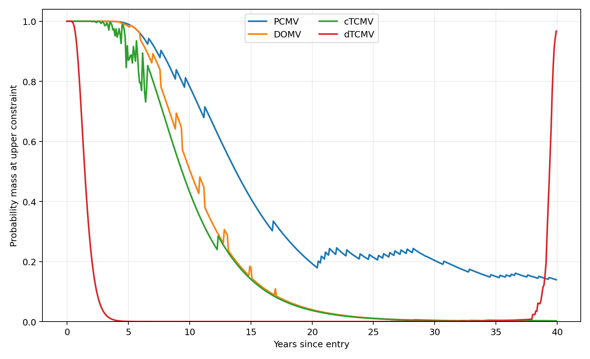

At each date, this figure reports the probability mass for which the upper risky-investment constraint binds, meaning that the entire current DC balance is invested in the risky asset. Early in membership, the current account balance is small relative to future contributions, so the upper constraint binds frequently under several optimal strategies. For dTCMV, the binding probability falls rapidly during the middle years but rises again in a state-dependent manner near retirement. This is inconsistent with a simple age-only declining glide path.

### 1.3 Free boundary of the upper constraint

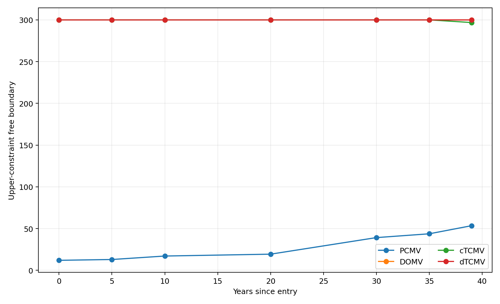

The figure shows, at representative dates, the numerical free boundary separating the all-risky region from the interior-control region. The PCMV boundary rises towards maturity, whereas the DOMV boundary remains broadly stable. The cTCMV boundary also rises over time. Under dTCMV, the upper-constraint region is mainly confined to low account balances. This does not mean that dTCMV avoids risk; within the interior region, it adjusts risky investment according to total pension wealth.

### 1.4 Projection gap by date

For cTCMV and dTCMV, the figure probability-weights the difference between the directly constrained solution and the clipped approximation obtained by projecting the unconstrained solution onto the feasible interval. The dTCMV gap is material from the early to middle years, indicating periods in which simple clipping does not adequately reproduce the state-dependent free boundary. The gap narrows near retirement, but this does not imply that clipping and direct constrained optimisation are theoretically identical.

## 2. Rolling conditional evaluation

### 2.1 Rolling conditional evaluation across all strategies

For each strategy, the median wealth state generated by that strategy is used as a new starting point. The figure reports the conditional terminal mean, conditional standard deviation, and current risky-asset proportion obtained by continuing the same feedback control from that state. Under PCMV, DOMV, and cTCMV, risk-taking generally declines as the remaining horizon shortens. dTCMV reduces its risky proportion during the middle years and then raises it again near retirement depending on realised wealth and time remaining. This behaviour distinguishes dTCMV from a simple age-dependent glide path.

## 3. Glide-path sensitivity analysis

The following five figures are based on an 80-step screening calculation with additional resolution in the low-wealth region. In every panel, **solid lines denote feedback controls obtained by solving the constrained problem directly, while dashed lines of the same colour denote the clipped approximation obtained by projecting the corresponding unconstrained solution onto `0 <= pi <= x`**. PCMV, DOMV, cTCMV, and dTCMV are each propagated under the wealth distribution generated by their own policy. These figures assess direction and robustness; they do not constitute a complete grid-convergence proof.

### 3.1 Sensitivity to the deterministic DB benefit \(D_T\)

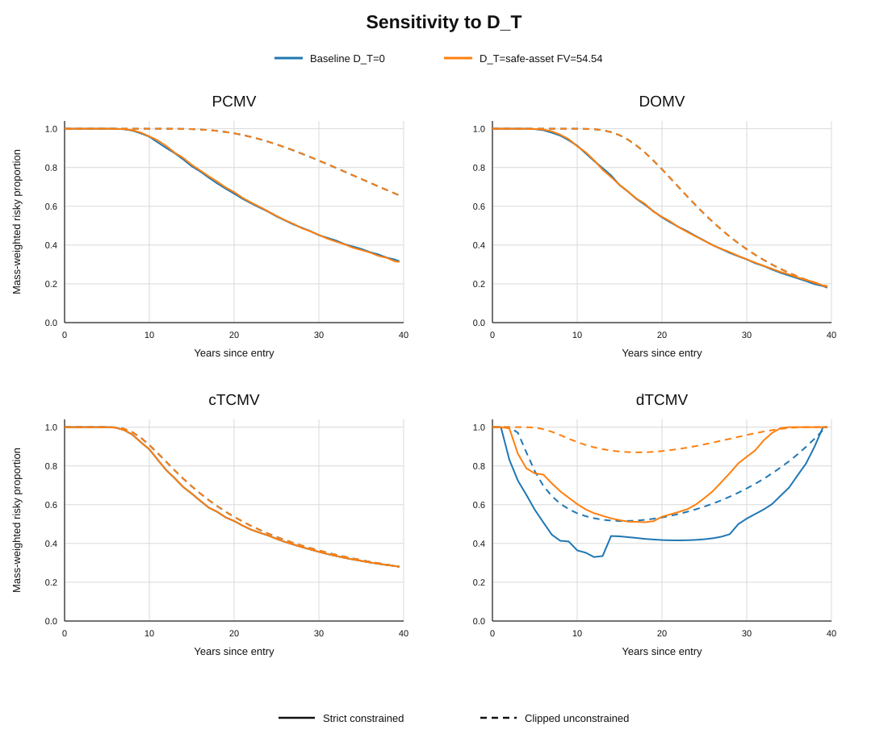

For the directly constrained PCMV, DOMV, and cTCMV problems, adding a deterministic DB benefit leaves the optimal glide path for the DC component almost unchanged. In these problems, the deterministic benefit enters the objective as a constant or location shift. For dTCMV, however, the DB benefit changes effective variance aversion, so both the directly constrained solution and the clipped approximation change. In particular, simple ex-post projection does not reproduce the state-dependent boundary of the directly constrained dTCMV problem.

### 3.2 Sensitivity to the risk-free rate \(r\)

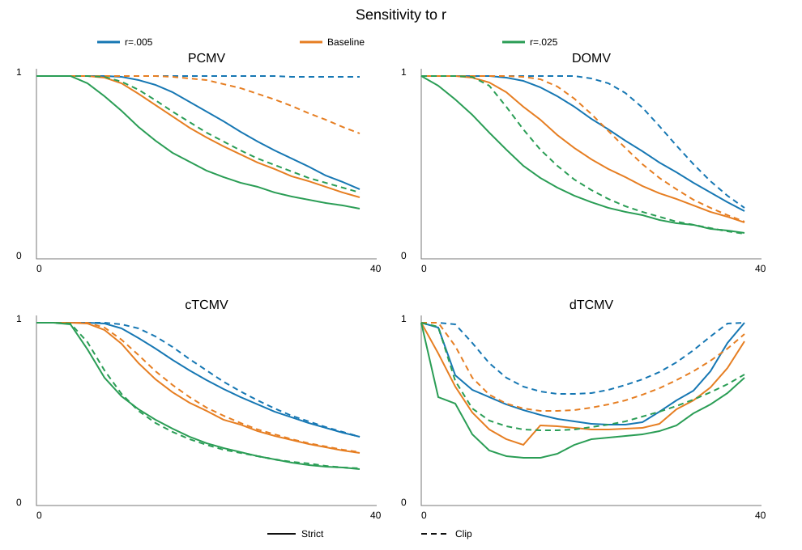

The baseline value is \(r=0.015\). A higher risk-free rate makes it easier to accumulate future wealth through the safe asset alone, so risky-asset proportions generally decline under the directly constrained policies. The distance from the clipped approximation does not change uniformly. For PCMV and DOMV, the time dependence of the unconstrained target or re-optimisation coefficient changes. For dTCMV, both the Volterra coefficient and the present value of future contributions change. The approximation gap therefore varies by parameter scenario.

### 3.3 Sensitivity to the expected risky return \(\mu\)

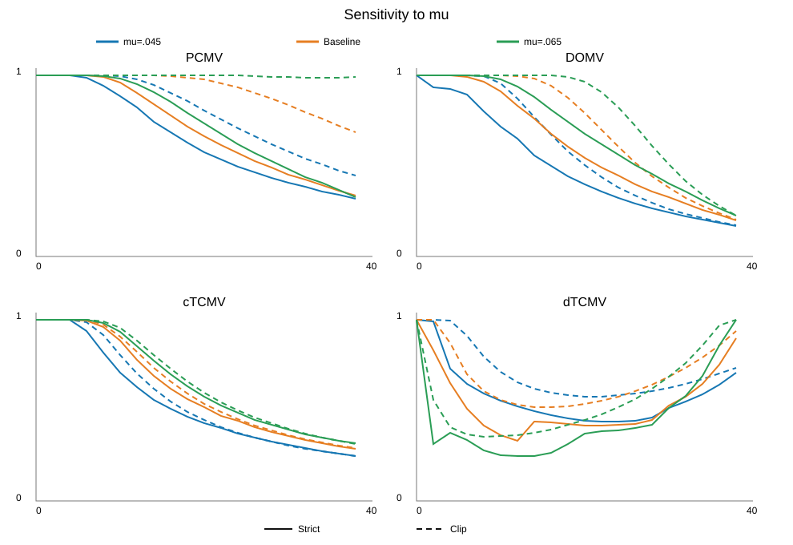

The baseline value is \(\mu=0.055\). A higher expected excess return increases the benefit of holding the risky asset under every solution concept. Under PCMV, the gap between the clipped fixed-target unconstrained policy and the directly constrained policy widens late in the horizon. Under dTCMV, a material gap remains from the early to middle years. The close agreement observed for cTCMV in the baseline case is therefore not a general property of other solution concepts or other expected-return assumptions.

### 3.4 Sensitivity to risky-asset volatility \(\sigma\)

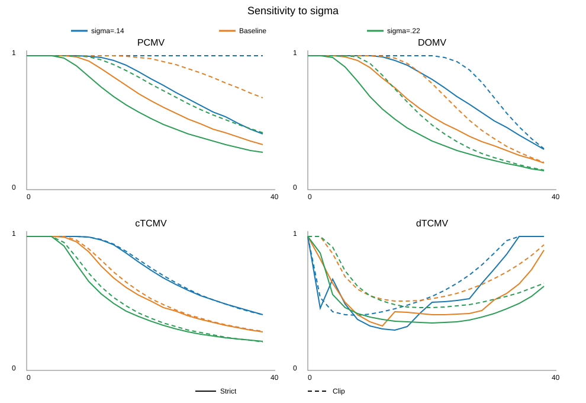

The baseline value is \(\sigma=0.18\). Higher volatility increases the variance cost and therefore generally lowers risky-asset proportions. Some cTCMV scenarios show relatively close directly constrained and clipped paths, but gaps remain for PCMV, DOMV, and dTCMV. In particular, the directly constrained dTCMV policy retains a middle-period trough and a pre-retirement increase, so its shape can differ from the clipped approximation rather than merely its level.

### 3.5 Sensitivity to the contribution profile

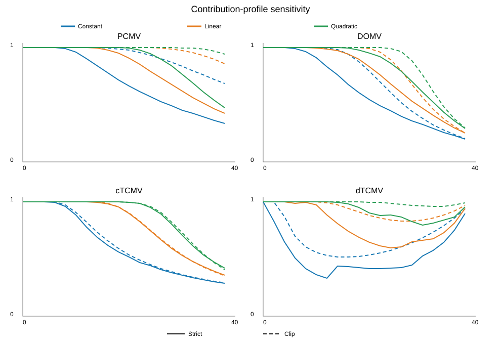

The comparison holds total contributions fixed and considers constant, linearly increasing, and quadratically increasing contribution profiles. Shifting contributions towards later years increases early human capital, defined here as the present value of future contributions, and therefore raises risky-asset proportions during the early and middle years. Except in the cTCMV cases where the paths are particularly close, changing the timing of contributions also changes the gap between directly constrained and clipped controls. The optimal glide path therefore depends not only on total contributions but also on the interaction between contribution timing and the state-dependent boundary.

The numerical gap summary is stored in [`results/sensitivity/all_strategies_strict_vs_clip_sensitivity_summary.csv`](../../results/sensitivity/all_strategies_strict_vs_clip_sensitivity_summary.csv). Running the same script also generates full-path CSV and NPZ files in the selected output directory.

## 4. Exploratory PCMV–MVS and DOMV–MVS results

### 4.1 Glide paths after recalibration

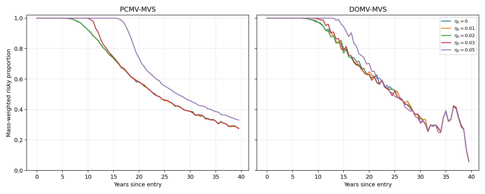

The figure shows PCMV–MVS and DOMV–MVS glide paths as the skewness coefficient \(\eta_0\) changes. At small coefficient values, the paths nearly coincide with their MV counterparts. Beyond an intermediate range, the timing of PCMV–MVS risk-taking changes materially. The DOMV–MVS response is smaller, although discretisation-related variation appears near the end of the horizon.

### 4.2 Terminal CDFs after recalibration

At small skewness coefficients, the terminal CDFs also remain close to the MV baseline. As the coefficient increases, the distribution changes most visibly under PCMV–MVS. Even where the central portions of two CDFs appear close, the third moment can react strongly to the extreme upper tail, so visual similarity around the centre does not imply equality of the full distributions.

### 4.3 Nonlinear response to the MVS coefficient

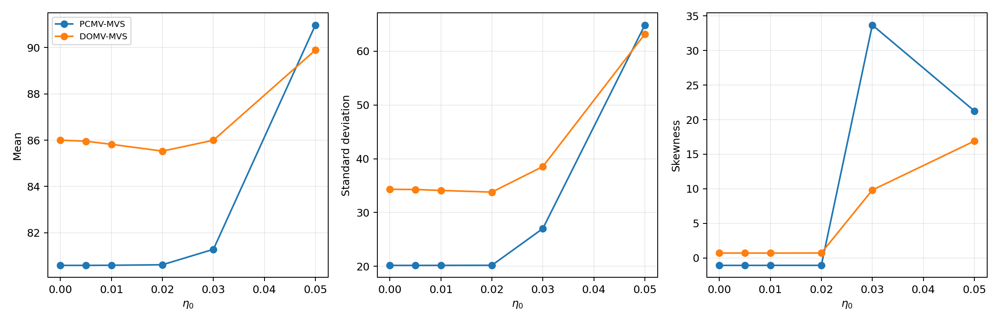

This figure summarises the response of the mean, standard deviation, and skewness to \(\eta_0\). Changes are limited for small coefficients, but at moderate and larger values the three statistics respond nonlinearly and a numerical regime change appears. The location of this transition may depend on the control grid, state grid, target search, and interpolation. It should therefore be interpreted as an exploratory numerical finding rather than a definitive practical threshold.

## 5. Detailed dTCMV–MVS results

### 5.1 Glide paths with fixed variance aversion

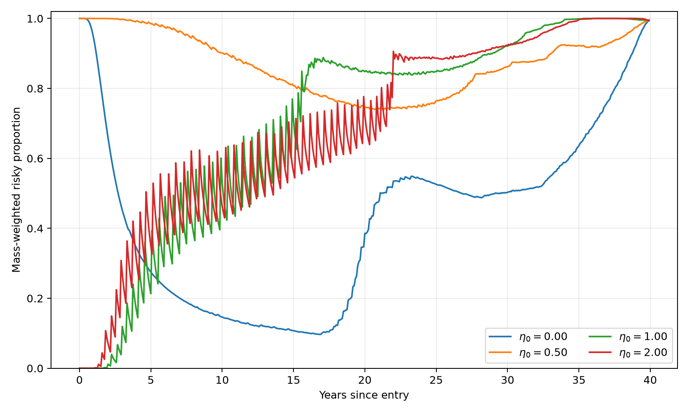

The variance-aversion coefficient is fixed at \(\gamma_0=2.5\), while only the skewness coefficient changes. Stronger skewness preference does not simply raise the risky proportion throughout the horizon. Instead, it shifts the timing of risk-taking, reorganising the middle-period trough and the increase near retirement.

### 5.2 Glide paths after equal-mean calibration

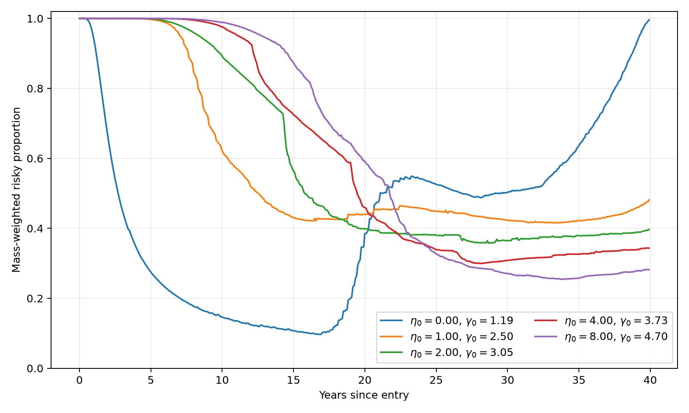

For each MVS strategy, the variance-aversion coefficient is recalibrated so that mean terminal wealth matches the MV baseline. The glide paths remain different even after the mean is held fixed, and the timing of risk-taking changes with the MVS coefficient. The MVS effect therefore cannot be explained solely by a higher expected terminal wealth.

### 5.3 Terminal CDFs after equal-mean calibration

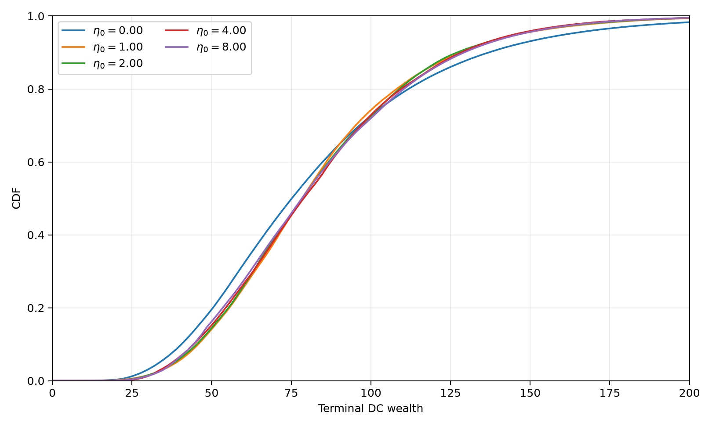

These are terminal CDFs after equalising the mean. The curves are close around the centre of the distribution, but differences remain in both tails. Strategies with the same mean can therefore have different combinations of variance, downside risk, upside participation, and skewness.

### 5.4 Downside–upside tail frontier

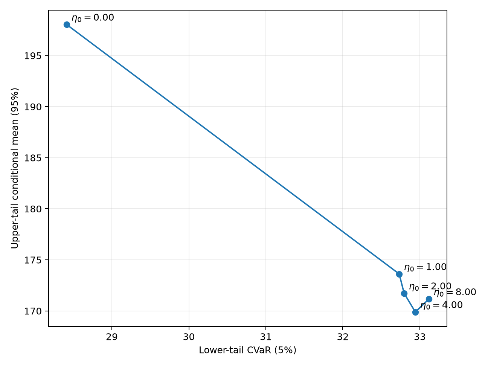

The horizontal axis is lower-tail 5% CVaR and the vertical axis is the conditional mean of the upper 5% tail. At moderate skewness coefficients, downside risk improves while the upper tail is initially compressed. At larger coefficients, participation in the right tail strengthens again. Increasing skewness preference therefore changes tail allocation nonlinearly rather than producing a monotone shift towards a uniformly higher-risk, higher-return policy.

### 5.5 Rolling conditional metrics

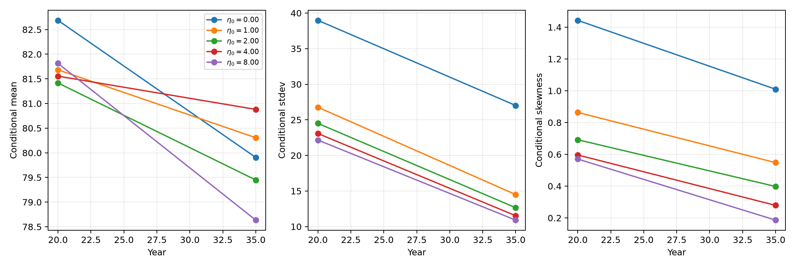

The figure reports the conditional mean, conditional standard deviation, and current risky-asset proportion when the strategy is re-evaluated from the median wealth state at years 20 and 35. Increasing the skewness coefficient can lower both the conditional standard deviation and the current risky proportion at these dates. MVS does not necessarily make the strategy uniformly more aggressive; it can combine right-tail formation over the full horizon with lower prospective risk at later intermediate states.

## Common interpretation cautions

- The sensitivity figures use an 80-step screening calculation, whereas the monthly baseline uses 480 steps.
- Directly constrained controls and clipped approximations are different solutions. Close plotted paths do not imply theoretical equality.
- Each clipped approximation projects the unconstrained solution corresponding to its own solution concept; one common formula is not imposed on PCMV, DOMV, cTCMV, and dTCMV.
- Because MVS includes a third-moment term, the objective can be non-concave and sensitive to the extreme upper tail, grid spacing, control candidates, and interpolation.
- Numerical regime changes and threshold values shown in the figures are exploratory. They are not practical calibration values supported by a comprehensive convergence analysis.
