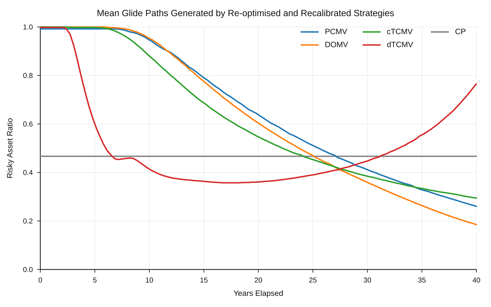

# ICA2026: Endogenous Glide Paths for Defined Contribution Pensions

This repository is the **English-language research, code, data, and validation companion** for an ICA2026 study on investment glide paths in defined contribution (DC) pension plans.

## Plain-English summary

A conventional DC glide path usually starts by choosing a shape for asset allocation over time—for example, a target-date path that gradually reduces risk as retirement approaches. This study reverses that logic. It asks: **given the member's objective, current state, and practical investment constraints, what pattern of risk-taking should follow from the optimisation problem itself?**

The main finding is that familiar shapes do not need to be imposed in advance. **Target-date, U-shaped, and intermediate glide paths can arise endogenously** from different decision principles and different specifications of variance aversion. The study then asks how those strategies should be interpreted in practice: as a design benchmark, a standard default, a periodic-review strategy, or a more personalised form of advice.

The numerical results, saved policies, and validation outputs in this repository are the authoritative current research artefacts. Historical and superseded material is kept separately under [`archive/`](archive/).

## Manuscript

**Title:** *Establishing a Unified Optimal Investment Strategy for Defined Contribution Pension Plans: Clipped versus Directly Constrained Mean–Variance Controls and a Three-Layer Glide-Path Design*  
**Author:** Yoshiki Nagayama, The Dai-ichi Life Insurance Company, Limited  
**Context:** ICA2026 manuscript and associated research materials

The manuscript PDF itself is **not distributed from this repository**. The [`paper/`](paper/) directory is a navigation and context page only. The corresponding Japanese research repository is [`dc-glidepath-ica2026`](https://github.com/yoshi123027-del/dc-glidepath-ica2026).

## Strategies at a glance

The study compares **four optimised mean–variance strategies** and one non-optimised benchmark. CP is therefore shown alongside the four solution concepts but is not a fifth optimisation concept.

| Label | Full name / decision concept | Intuition | Practical interpretation |
|---|---|---|---|
| **PCMV** | Pre-commitment mean–variance | Choose the plan at enrolment and commit to it rather than re-solving later | Design benchmark for the initial risk–return trade-off |
| **DOMV** | Dynamically optimal mean–variance | Re-optimise from the member's current state | Candidate for periodic review |
| **cTCMV** | Time-consistent mean–variance with constant variance aversion | Use a time-consistent equilibrium with one constant strength of variance aversion | Candidate for a standard default |
| **dTCMV** | Time-consistent mean–variance with total-pension-wealth-dependent variance aversion | Let the strength of variance aversion depend on the member's total pension wealth | Candidate for personalised advice |
| **CP** | Constant-proportion benchmark | Hold a constant risky-asset proportion through time | Simple comparison benchmark; not an optimised strategy |

Here, *variance aversion* describes how strongly dispersion of terminal wealth is penalised relative to expected terminal wealth.

## Main research message

The figure below shows the mean glide paths generated by the current recalibrated policies. It is an existing current-result figure; no new optimisation or simulation was run to produce it for this README.



The proposed practical interpretation has **three operating layers**:

1. **cTCMV — standard default:** a time-consistent policy with a common variance-aversion specification.
2. **DOMV — periodic review:** a strategy that explicitly re-solves from the member's current state when the plan is reviewed.
3. **dTCMV — personalised advice:** a time-consistent policy whose variance aversion changes with total pension wealth.

PCMV is deliberately **not** a fourth operating layer: it represents commitment to the plan selected at enrolment and is used as a design benchmark. Mean–variance–skewness (MVS) results are also not treated as an operating layer; they remain an exploratory research extension because calibration, non-concavity, and numerical stability require additional care.

## Principal results

The table below reproduces the current independent Monte Carlo results. Expected terminal wealth is matched near **84.78**, so the comparison focuses on distribution shape and the timing of risk-taking rather than differences in the mean.

| Policy | Mean | SD | 5th percentile | Median | 95th percentile | Mean of worst 5% |
|---|---:|---:|---:|---:|---:|---:|
| PCMV | 84.7715 | 18.9424 | 38.1937 | 92.3501 | 100.2246 | 28.7985 |
| DOMV | 84.7831 | 24.4139 | 46.8690 | 83.4760 | 127.0602 | 39.2036 |
| cTCMV | 84.7913 | 23.1570 | 47.1606 | 84.4674 | 123.4706 | 38.5271 |
| dTCMV | 84.7863 | 32.3127 | 43.1728 | 79.2581 | 145.2516 | 37.3322 |
| CP | 84.7854 | 31.6874 | 45.2269 | 78.9299 | 144.1862 | 39.8995 |

Wealth is reported in the model's normalised units: the annual contribution is normalised to **1**, and the initial DC balance is **1/12**. These results do not imply that one policy dominates on every outcome measure.

The underlying saved statistics are in [`results/current/independent_mc.csv`](results/current/independent_mc.csv). The current numerical artefacts are preserved unchanged by the documentation work in this repository.

## Where to look

The top-level README is intended to be the main entry point. The current authoritative areas are:

| Area | What it contains |
|---|---|
| [`results/current/`](results/current/) | Saved policies, calibration parameters, and principal reported results |
| [`results/validation/`](results/validation/) | Evaluator comparisons, numerical checks, robustness results, and the external benchmark |
| [`recalibration/`](recalibration/) | Numerical implementation and reproduction instructions |
| [`paper/`](paper/) | Manuscript context and navigation only; no manuscript PDF |
| [`CODEBOOK.md`](CODEBOOK.md) | Concise path-by-path guide for readers who want more detail |

Everything under [`archive/`](archive/) is **historical, exploratory, or superseded**. Archived Japanese manuscripts and figures are retained for auditability and should not be read as current English research outputs.

## Quick start / reproduction

Install the Python dependencies from the repository root:

```bash
python -m pip install -r requirements.txt
```

### A. Inspect the reported results without recomputing them

No optimisation or Monte Carlo run is needed. Start with:

- [`results/current/README.md`](results/current/README.md)
- [`results/current/independent_mc.csv`](results/current/independent_mc.csv)
- [`results/validation/README.md`](results/validation/README.md)

### B. Reproduce the evaluator comparison

The evaluator comparison applies MGH forward propagation and independent Euler–Monte Carlo evaluation to the **same saved policies**. By default, the command below reuses the stored one-million-path Monte Carlo output rather than regenerating it:

```bash
python recalibration/evaluator_comparison.py \
  --data-dir results/current \
  --out results/validation/evaluator_comparison

python recalibration/plot_evaluator_comparison.py \
  --data-dir results/current \
  --validation-dir results/validation/evaluator_comparison
```

See [`recalibration/EVALUATOR_COMPARISON.md`](recalibration/EVALUATOR_COMPARISON.md) for definitions and output details. Do **not** add `--rerun-mc` unless you intentionally want to regenerate the one-million-path Monte Carlo evaluation.

### C. Full optimisation and recalibration

The full baseline solve is substantially more computationally and storage intensive—especially the target-family calculation required for DOMV. The exact production-grid sequence and parameters are documented in [`recalibration/README.md`](recalibration/README.md). The stored outputs in `results/current/` are sufficient for reading, auditing, and reproducing the reported comparisons without rerunning the full solve.

## Numerical method in one paragraph

The four optimised strategies—PCMV, DOMV, cTCMV, and dTCMV—are handled within a common **Markov–Gauss–Hermite (MGH)** numerical architecture. In broad terms, the method solves or evaluates decisions backward on a finite wealth grid and then propagates the resulting wealth distribution forward. The implementation separately distinguishes controls obtained by solving the constrained problem directly from a clipped approximation of the corresponding unconstrained policy. The saved policies are also checked with an independent monthly Euler–Monte Carlo evaluator. CP is a benchmark and is not one of the four optimisation concepts. Technical definitions, grid settings, and validation details are in [`recalibration/README.md`](recalibration/README.md) and [`results/validation/`](results/validation/).

## Validation

Three complementary checks are published:

- [Backward/forward consistency, grids, boundaries, and quadrature](results/validation/recalibration/)
- [MGH forward versus independent Euler–Monte Carlo on identical saved policies](results/validation/evaluator_comparison/)
- [External mean–variance benchmark based on van Staden, Dang and Forsyth (2021)](results/validation/van_staden_2021/)

These checks support the numerical implementation; they do not claim continuous-time exactness or that one investment policy is universally superior.

## Citation

A provisional citation is:

> Nagayama, Y. *Establishing a Unified Optimal Investment Strategy for Defined Contribution Pension Plans: Clipped versus Directly Constrained Mean–Variance Controls and a Three-Layer Glide-Path Design*. ICA2026 manuscript.

Citation information will be updated when the final conference citation is available.

This repository is released under the [MIT License](LICENSE).
